```{python}
#| label: setup
import pandas as pd
import numpy as np
import matplotlib.pyplot as plt
from matplotlib.patches import Patch

plt.rcParams["figure.dpi"] = 150
plt.rcParams["font.size"] = 10
```

## Mon interêt pour les outils IA

:::{.columns}
::: {.column width="50%"}
::: {.card}
- Intérêt croissant depuis 2023 suite à un stage chez les Pompiers de Paris
- Utilisation régulière depuis 2024
- Codex, Copilot, Claude Code, NotebookLM, etc.
:::
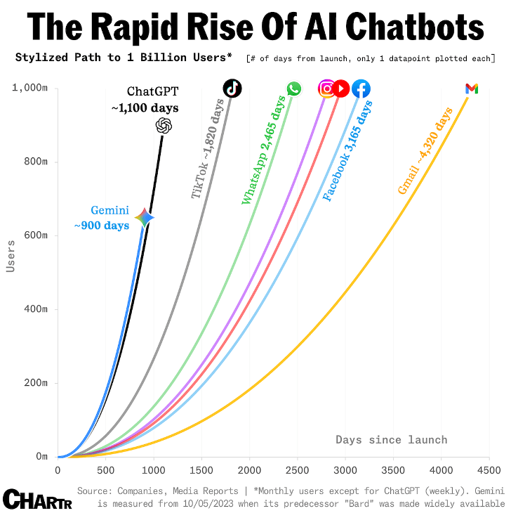{width="60%" fig-align="center"}
:::
::: {.column width="50%"}
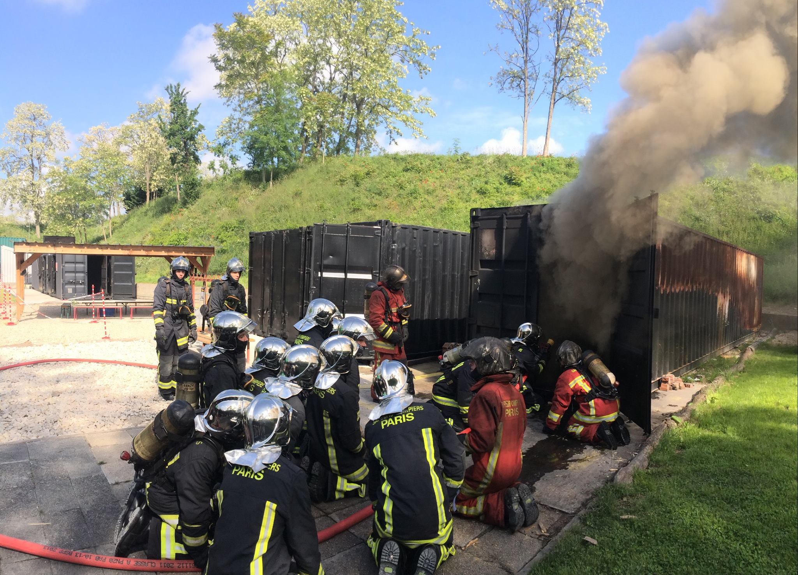{width="60%" fig-align="center"}

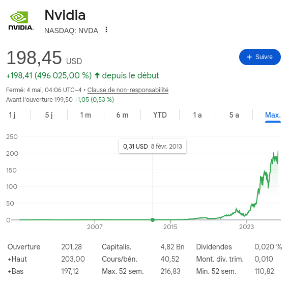{width="60%" fig-align="center"}
:::
:::

## Au programme d'aujourd'hui

::: {.card}
- Courte introduction
- Activité 1 — NotebookLM pour la revue de littérature et plus
- Activité 2 — Agents pour le codage et le debugging
- Activité 3 — Gestion de la mémoire des projets
- Conclusion and discussion
:::

::: {.callout-important}
1) **Un ordinateur** : Si possible, apportez votre ordinateur pour les activités pratiques. Pas de panique, on fera aussi des démos. 
2) **Travail en binôme :** Comme vous le souhaitez, travaillez avec un voisin ou en solo.
:::


## Pourquoi ce talk?

::: {.columns}
::: {.column width="54%"}
::: {.card}
**Pain points**

:::{.incremental}
- Trop de papiers, pas assez de temps pour faire le tri
- Un bug de code caché dans 10k lignes de code
- Idée claire sous la douche, floue au clavier
- TikZ est un maître cruel et impitoyable

**Promesse honête**

- IA ne remplacera pas le jugement
- IA ne prouvera pas votre théorème (encore) [@axiom_math]
- IA peut enlever une énorme friction
:::
:::
:::

::: {.column width="46%"}
{fig-alt="My dream AI assistant" width="92%"}

:::
:::

---


## Tour de table : Quels outils ? Quels usages ?

::: {.card}
:::{.incremental}
- **Quels outils IA utilisez-vous déjà ?**
- **Quels usages vous intéressent le plus ?**
:::

:::{.fragment}
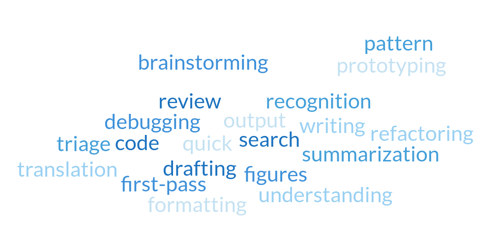{fig-alt="Word cloud with traits of AI agents: infinite energy, zero shame, uneven reliability" width="60%" fig-align="center"}
:::

:::{.fragment}
**Imaginez les outils d'agents IA comme un chercheur junior avec une énergie infinie, zéro honte, et une fiabilité inégale.**
:::

:::


---

## Qu'est-ce qu'un LLM (1) ?

::: {.card}
Un LLM (Large Language Model) est un modèle entraîné sur une quantité pharaonique de texte et de code pour prédire le prochain token $P(\text{token}_t\mid \text{token}_{<t})$ :

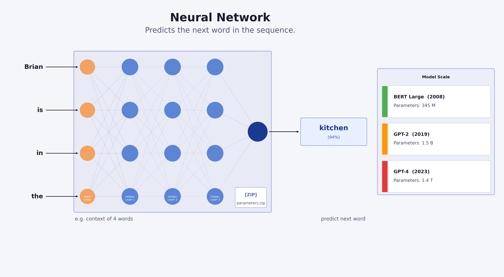{fig-alt="Neural network illustration, representing LLMs" width="70%" fig-align="center"}

:::

---

## Qu'est-ce qu'un LLM (2) ?

::: {.columns}
::: {.column width="50%"}
:::{.card}
**Qu'est-ce que ça veut dire en pratique?**

- Machines à faire de la complétion de texte.
- **PAS des bases de données**, ni des garanties de vérité [@openai_hallucinate].
- Vachement utile quand ils sont connectés à des outils (fichiers, code, recherche, tests).
- Prompt précis -> Meilleurs résultats
:::
:::
::: {.column width="50%"}
{fig-alt="Neural network illustration, representing LLMs" width="60%" fig-align="center"}
:::
:::

---

## Chat mode vs Agent mode

::: {.columns}
::: {.column width="50%" .fragment}
::: {.card}
**Chat mode**

- Un prompt -> une réponse
- Idéal pour explications et brainstorming
- Exemple : "Expliquez Gibbs-Thomson en termes simples."

{fig-alt="Chat mode illustration, one prompt one answer" width="95%"}
:::
:::
::: {.column width="50%" .fragment}
::: {.card}
**Agent mode**

- Lire fichiers/docs, éditer du code, exécuter des tests, patch
- Exemple pour le codage : "Scan repo, implement a new function, keep API, add tests."

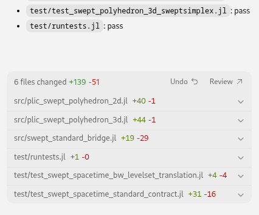{fig-alt="Agent mode illustration, multi-step interaction" width="60%" fig-align="center"}
:::
:::
:::

---

## Tour d'horizon des outils disponibles

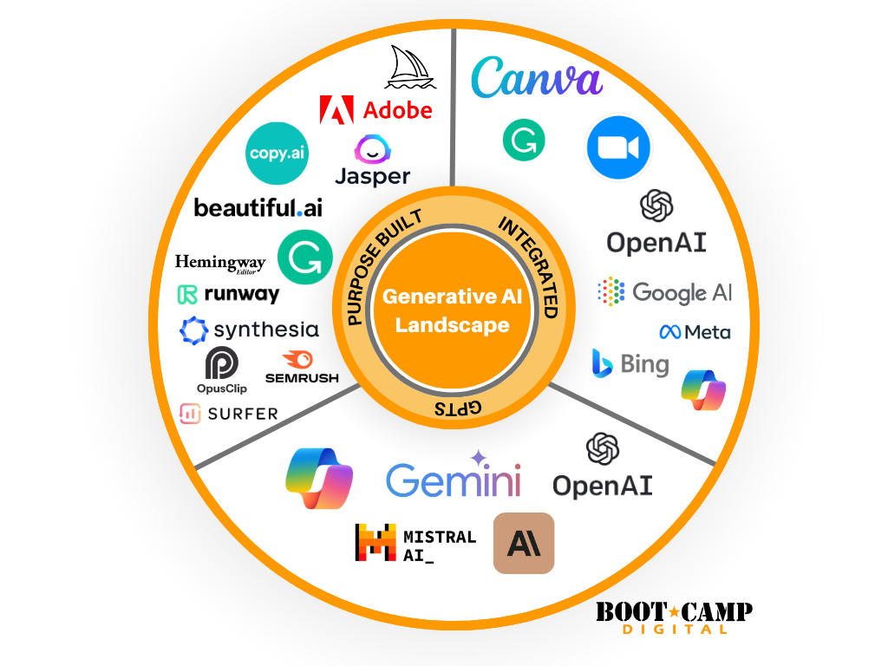{fig-alt="Landscape of generative AI tools, including Codex, GitHub Copilot, Claude Code, OpenCode, Gemini, Mistral, OpenRouter"  fig-align="center"}

## Tour d'horizon des outils disponibles

<iframe src="handouts/index.html" width="100%" height="600px" style="border:none;" margin="0"></iframe>

---

## Activité 1: NotebookLM pour la revue de littérature et plus

::: {.card}
**NotebookLM** (Google) permet de télécharger des documents et de poser des questions à leur sujet. Il peut être utilisé pour la revue de littérature, la synthèse, et plus encore.
:::

URL : [NotebookLM](https://notebooklm.google.com/?icid=home_maincta&_gl=1*1sl5wzi*_ga*MTMxODE1MDAyMy4xNzc2NDIwNDc3*_ga_W0LDH41ZCB*czE3NzY2MDcwODUkbzIkZzEkdDE3NzY2MDcxODQkajYwJGwwJGgw)

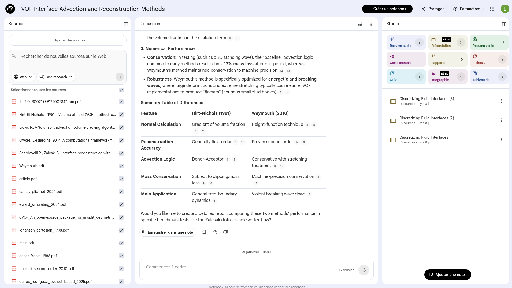{fig-alt="Screenshot of NotebookLM interface, showing a document upload and question-answering interface" width="80%" fig-align="center"}

---

## Activité 2: Agents pour le code

::: {.card}
- Agents de codage (Codex, Copilot, Claude Code) via IDE ou terminal
- Instructions de projet (`AGENTS.md`) pour guider les agents
- Compétences (`SKILL.md`) pour les tâches récurrentes
- Sous-agents pour les tâches parallèles (ex: un agent pour l'implémentation, un autre pour les tests)
:::


---

## Iterations par modele et scenario

::: {.card}
Comparatif simple des iterations et tokens consommes par scenario.
:::

```{python}
#| label: prompt-iterations-table
df_prompt = pd.read_csv("data/prompt_iterations.csv")
df_prompt

df_plot = df_prompt.copy()
models = df_plot["model"].unique().tolist()
scenarios = df_plot["scenario"].unique().tolist()

x = np.arange(len(models))
width = 0.75 / max(1, len(scenarios))

palette = ["#1B9E77", "#D95F02", "#7570B3", "#E7298A"]
color_map = {s: palette[i % len(palette)] for i, s in enumerate(scenarios)}

fig, ax = plt.subplots(figsize=(7.4, 3.6))

for i, scenario in enumerate(scenarios):
    subset = df_plot[df_plot["scenario"] == scenario].set_index("model")
    tokens = subset.reindex(models)["tokens_consumed"].to_numpy()
    iterations = subset.reindex(models)["iterations"].to_numpy()
    offsets = x - (len(scenarios) - 1) * width / 2 + i * width
    bars = ax.bar(offsets, tokens, width, color=color_map[scenario], alpha=0.85)
    ax.bar_label(bars, labels=[str(v) for v in iterations], padding=2, fontsize=7)

ax.set_title("Tokens consommes par modele et scenario")
ax.set_ylabel("Tokens consommes")
ax.set_xticks(x, models, fontsize=8)

legend_handles = [Patch(color=color_map[s], label=s) for s in scenarios]
ax.legend(handles=legend_handles, title="Scenario", fontsize=7, title_fontsize=8)
plt.tight_layout()
```

---

## Pourquoi on atteint les limites ?

- Cache misses
- Context bloat
- Mauvais modèle / mauvais effort
- Mauvais format d'entrée

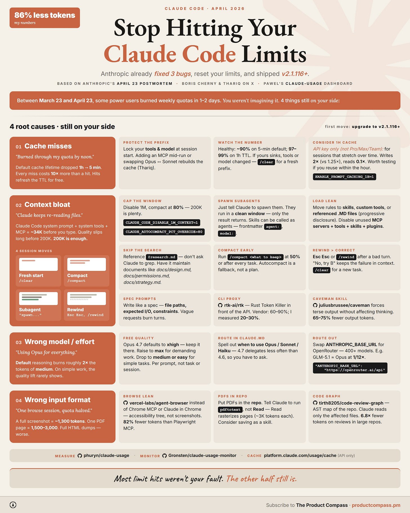

---

## Le vrai levier : protéger le préfixe caché

- Choisir outils/MCP au début
- Choisir modèle au début
- Ne pas changer `/model` en cours
- Garder `AGENTS.md` / `CLAUDE.md` courts
- Déplacer le détail vers `MATH.md`, `TESTING.md`, `SKILL.md`

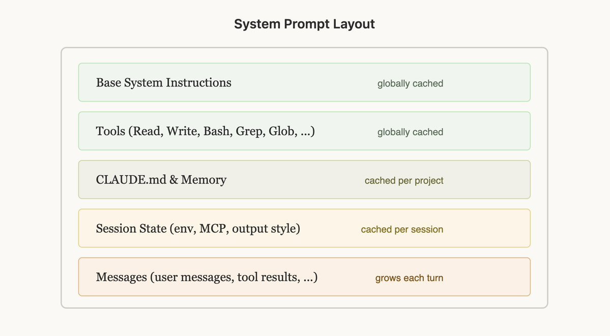

---

## Hygiène de session

- `/clear` entre deux sujets
- `/compact` après une tâche ou vers 50–80%
- `/rewind` si la session part mal
- Subagents pour lecture massive, logs, PDF, recherche fichiers

> Ne laissez pas l'agent relire votre repo entier à chaque question.

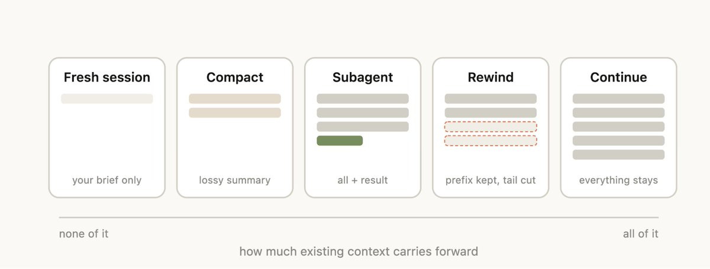

---

## Choisir le bon modèle

- Petit modèle : grep, renommage, formatage
- Moyen modèle : exploration code, tests, synthèse locale
- Gros modèle : architecture, compromis numériques

> L'effort se règle par prompt.

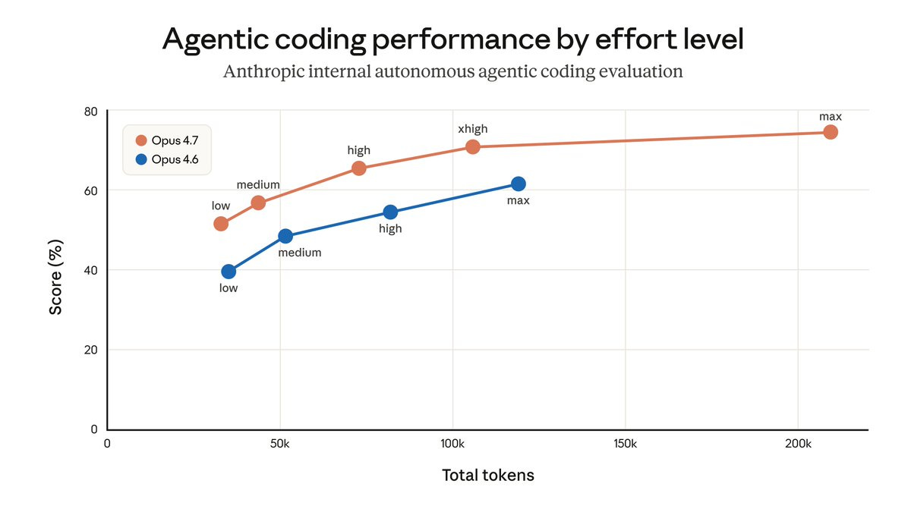

---

## Mauvais format = tokens brûlés

- Web : texte / accessibility tree plutôt que screenshots
- PDF : `pdftotext` avant images
- Gros repo : carte de code / graphe plutôt que lecture brute

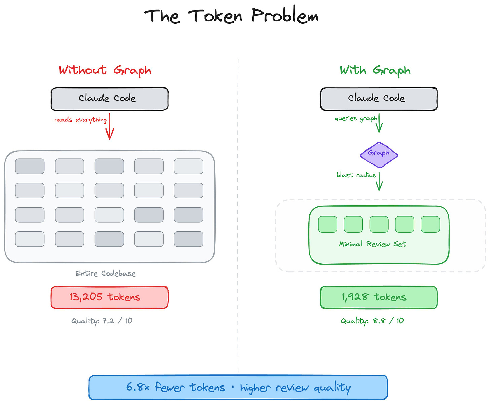

---


## Activité 3: Gestion de la mémoire des projets

::: {.columns}
::: {.column width="40%"}
::: {.card}
- **Problème** : Faible mémoire à long term des LLMs
- ex : 400k tokens pour Codex 5.3 High
- **Solution** : Fichiers de projet (`AGENTS.md`, `MATH.md`, `SKILL.md`) pour stocker les faits, règles, théorèmes, procédures
- **Solution** : [LLMWiki](https://gist.github.com/karpathy/442a6bf555914893e9891c11519de94f) + Obsidian pour une mémoire de projet plus riche et interconnectée
:::
:::

::: {.column width="60%"}
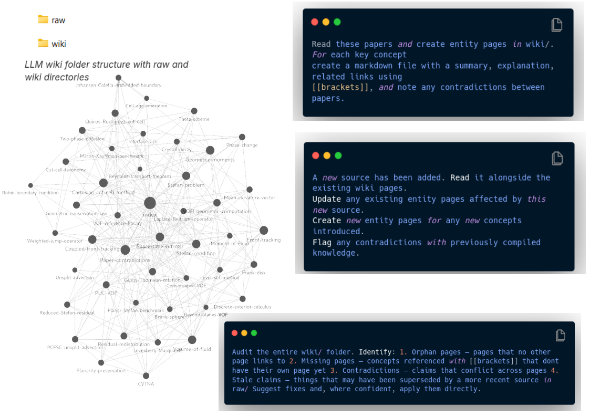{fig-alt="Screenshot of Obsidian interface, showing a graph view of interconnected notes" width="100%" fig-align="center"}
:::
:::


---

## Quelques points clés 

::: {.card}
- Notion de Context Window
- Taille des modeles et coût : choisir le bon outil pour la bonne tâche
- De l'importance du prompt pour guider les agents
- Validation humaine indispensable pour éviter les erreurs et les "hallucinations"
:::

{fig-alt="Illustration of context window, showing a sliding window of tokens that the model can attend to" width="60%" fig-align="center"}

---

## Discussion

:::{.titlebox}
- Quels sont les avantages et les limites de ces outils dans votre pratique ?
- L'importance de la validation humaine : comment éviter les "hallucinations" et garantir la fiabilité des résultats ?
- Confidentialité et éthique : comment gérer les données sensibles et les implications éthiques de l'utilisation de l'IA dans la recherche ?
- De l'utilisation de ces outils en commun.
:::

---

## Useful links

- MCP intro: <https://modelcontextprotocol.io/docs/getting-started/intro>
- OpenAI Codex docs: <https://developers.openai.com/codex>
- GitHub Copilot docs: <https://docs.github.com/en/copilot>
- Claude Code docs: <https://docs.anthropic.com/en/docs/agents-and-tools/claude-code/overview>
- OpenCode: <https://opencode.ai>

::: {#refs}
:::

